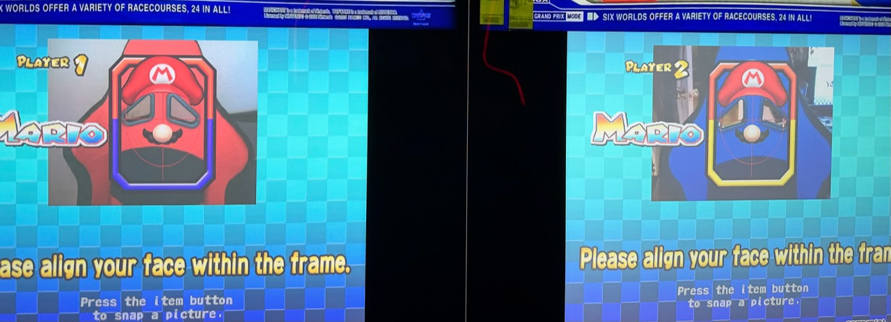
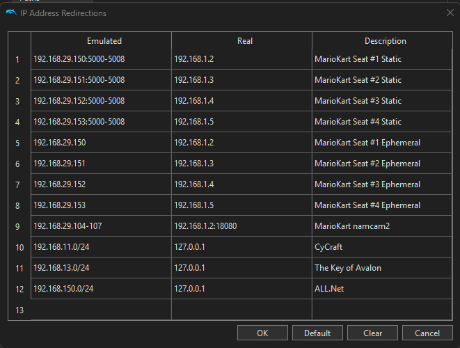

# Camera Bridge



Show your USB webcam picture in the game. Each cabinet needs its own webcam and copy of Camera Bridge.

**[Download Camera Bridge](https://github.com/ArcadeAdam/camera-bridge/releases/download/v1.0.0-rc.4/camera-bridge-1.0.0-rc.4-win-x64.zip)** — Windows 10/11, 64-bit, with .NET Framework 4.8 or newer.

## 1. Start the camera

1. Plug in your webcam. Close other camera apps.
2. Download the ZIP. Right-click it and choose **Extract All**.
3. Keep **CameraBridge.exe** and **CameraBridge.cfg** in the same folder.
4. Open **CameraBridge.exe**. Check that you see a picture.

Need to change settings? Click **Edit settings**, save the CFG file, then click **Start camera**.

## 2. Connect the game

In the emulator, open **Triforce → IP Address Redirections**. Find the camera row called **namcam2**:

| Field | Enter this |
| --- | --- |
| Emulated | `192.168.29.104-107` |
| Real | The camera address shown in the bridge app, such as `192.168.1.2:18080` |

Use **this cabinet's own address**. Do not use `127.0.0.1` or add `http://`. Keep your other working network rows.



## 3. Set GP2 video settings

Use these settings on **both cabinets**.

1. Close the game and emulator.
2. In the emulator folder, open `User\GameSettings\GNLE82.ini` with Notepad. Make a backup first.
3. Add these lines and save:

```ini
[Video_Hacks]
EFBToTextureEnable = False
DeferEFBCopies = False
```

If `[Video_Hacks]` already exists, change or add the two settings in that section. [Help finding or editing the file](docs/SETUP.md#gp2-linked-photo-fix).

## 4. Play

1. Restart the emulator after setup. Turn the camera **ON** in the game's test menu.
2. For linked play, set **GAME OPTIONS → PCB ID** to **1** on the first cabinet and **2** on the second.
3. Start Camera Bridge before the game. Take new photos and check both players' pictures.

Keep the bridge open while playing. Close it when you finish.

## Optional: LaunchBox start and stop

Add two **Additional Apps**, both pointing to `CameraBridge.exe`:

- Before the game: use `--start` and check **Wait for Exit**.
- After the game: use `--stop` and leave **Wait for Exit** unchecked.

[Follow the step-by-step LaunchBox guide](FRONTEND.md). The download does not change these settings for you.

[More settings and help](docs/SETUP.md) · [Test results](VALIDATION.md) · [Source code guide](docs/SOURCE.md)
